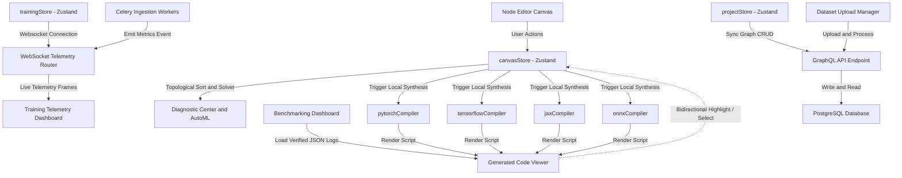
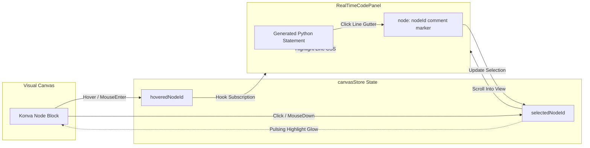
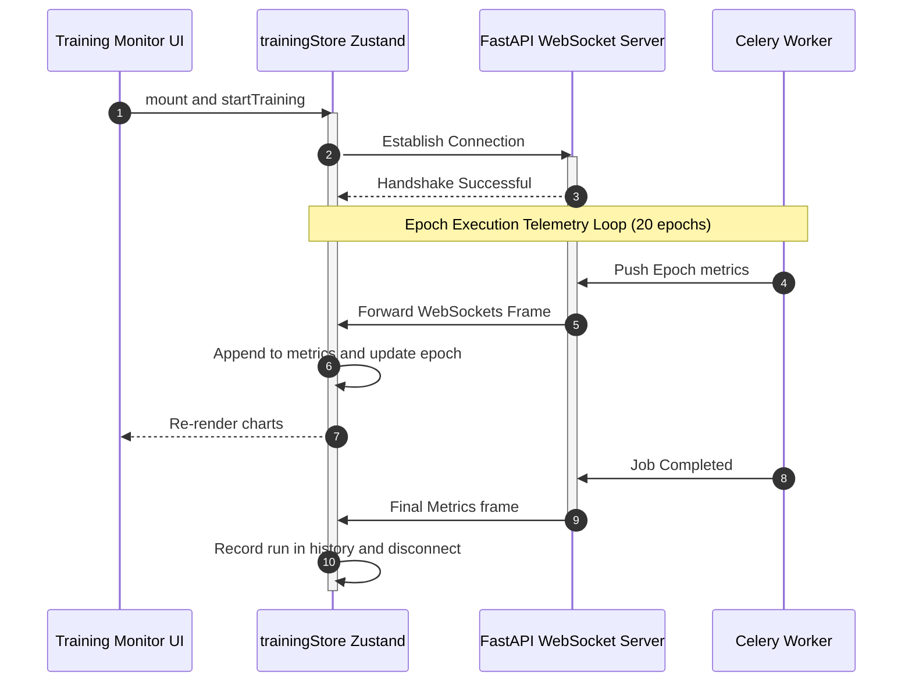

# ArchNet Visual Neural Network Designer & Compiler

ArchNet is an enterprise-grade, high-fidelity visual workspace for designing, auditing, compiling, and testing deep learning architectures. It empowers machine learning engineers to design complex model graphs, configure training hyperparameters, validate tensor shape matching, run animated forward passes, and instantly compile production-ready modules to PyTorch, TensorFlow, JAX, or ONNX.

---

## 🚀 Key Features

* **Interactive Canvas Workspace**: A high-performance vector graphics board powered by **Konva.js** supporting node dragging, socket connect ports, bezier linkages, multi-selection, and group operations.
* **Topological Shape Solver**: Automatically propagates and calculates tensor sizes downstream from root input parameters in real-time, verifying rank compatibility and broadcasting compliance.
* **Diagnostic Center & AutoML Copilot**: A strict AST compiler and heuristical rules auditor that scans active graphs and saved library components for loop cycles, disconnected nodes, and anti-patterns.
* **Bidirectional Trace Viewer**: Select nodes on the canvas to highlight and auto-scroll corresponding generated code lines, or click tracking comments (`# node: {nodeId}`) in the code editor to highlight/select nodes on the canvas.
* **Compiler Explanation Mode**: Click any node on the canvas to inspect its step-by-step shape solver logic, active hyperparameters, parameters formula, and calculated weights arithmetic.
* **Multi-Framework Compiler**: Generates clean, production-grade Python classes (`class GeneratedModel`) conforming to standard PyTorch, TensorFlow, Flax (JAX), and ONNX specifications.
* **Framework Benchmarking Dashboard**: Compare compiled model latency (ms/batch) and peak VRAM allocations (GB) across PyTorch, TensorFlow, and JAX using interactive charts.
* **SOTA Pre-trained Model Gallery**: Browse ResNet, BERT, ViT, and GraphSAGE models, view historical training curves, and download pre-trained weights hosted on Hugging Face.
* **Dataset Manager**: Ingestion area featuring drag-and-drop CSV/ZIP uploading, tabular data previews, and database processing status tracking.
* **Training Telemetry & Monitor**: Stacked vertical monitor panel plotting training/validation loss and validation accuracy curves in real-time using `recharts` connected to live WebSockets.
* **Sandbox Mode**: A zero-login interactive playground for guest builders to draft models, run forward pass animations, and browse templates. Restricts premium functions (ONNX export, framework comparison, version diffing) with context-aware login dialog prompts.

---

## 🆕 Recent Updates

- **Bidirectional Trace Viewer**: Integrated decoupled `hoveredNodeId` and `selectedNodeId` states globally, automatically matching code comments to Konva visual elements.
- **Compiler Explanation Mode**: Exposed shape solver math in the explainability panel, displaying formula variables and weight equations (e.g. convolution channels projection).
- **Credibility Dashboard & Walks**: Expanded documentation with an interactive Compiler Architecture flowchart and a 3-step Node-to-Code mapping walkthrough.
- **Framework Benchmarking Page**: Plotted execution latencies and VRAM usage on A100/RTX 4090 configurations using Recharts charts loaded from verified Python metrics.
- **Hugging Face Weight Releases**: Integrated lightweight weight cards linking ResNet, BERT, ViT, and GraphSAGE checkpoints to Hugging Face repositories.
- **Premium UI Polish & Micro-interactions**: Integrated `framer-motion` for fluid, spring-physics slide transitions when opening or closing left, right, and bottom layout panels.
- **Weighty Canvas Dragging**: Refactored Konva nodes to scale up (1.03x centered) and cast realistic drop shadows when dragged or selected.
- **Interactive Grid Snapping**: Adjusted the CSS background dot-grid to exactly match the `20px` snapping grid and dynamically tint the dots blue during active node dragging.

---

## 🏗️ Architectural Overview

### 1. General System Architecture Flow
This flowchart illustrates the relationships between the frontend workspace, state managers, compiler layers, and FastAPI/PostgreSQL cloud backends.



### 2. Bidirectional Trace Mapping
This diagram maps how user interface interactions in the canvas and the code panels are synchronized bidirectionally.



### 3. WebSockets Telemetry Flow
Telemetry updates from backend Celery tasks or local simulators cascade into charts and experiment histories.



---

## 🛠️ Technology Stack

| Category | Technology | Purpose |
| :--- | :--- | :--- |
| **Framework** | Next.js 16 (App Router) | Static page rendering and layout routing |
| **Core Runtime** | React 19 & TypeScript 5 | Strict typing and component hierarchy |
| **Canvas Graphics** | Konva.js & `react-konva` | Interactive workspace vector canvas |
| **State Manager** | Zustand 5 | Client-side reactive stores (Canvas, Project, Training) |
| **Charts** | Recharts v3 | Telemetry and benchmarking charts |
| **Styling** | Tailwind CSS v4 & Vanilla CSS | Glassmorphism, animations, HSL themes |

---

## 📁 Repository Structure

```text
frontend/
├── public/                     # Static public assets
│   └── artifacts/              
│       ├── benchmark_data.json # Comparative execution logs
│       └── sota_metadata.json  # Pre-run training curves and Hugging Face URLs
│
├── src/
│   ├── app/                    # Next.js App Router Page View Controllers
│   │   ├── page.tsx            # Main Model Workspace landing dashboard
│   │   ├── layout.tsx          # General page template controller
│   │   ├── globals.css         # Custom background animations, scrolls and dark variables
│   │   │
│   │   ├── docs/               # Docs, Compiler Architecture flow, and model walkthroughs
│   │   ├── datasets/           # Dataset Drag-and-Drop repository page
│   │   ├── editor/[projectId]/ # Dynamic interactive Canvas Node Editor workspace
│   │   │   ├── benchmark/      # Framework benchmarking page with Recharts
│   │   │   ├── deploy/         # Deploy setup panel
│   │   │   ├── experiments/    # Runs history comparator
│   │   │   ├── inference/      # Model testing API client
│   │   │   └── training/       # WebSocket telemetry dashboard
│   │   │
│   │   ├── models/             # Base visual templates importer panel
│   │   │   └── research/       # Prebuilt templates gallery
│   │   └── settings/           # API credentials and sync setups
│   │
│   ├── components/             # Reusable Visual Custom Modules
│   │   ├── Layout/             # Header, Sidebar, MainLayout
│   │   ├── Canvas/             # Interactive Canvas modules (NodeGraph, CanvasWrapper)
│   │   ├── Panels/             # LayerLibrary, ConfigPanel, ExplainabilityPanel (Explanation Mode)
│   │   ├── Modals/             # Code Preview and versioning popups
│   │   └── Training/           # Training dashboard widgets (Charts, History panels)
│   │
│   ├── store/                  # Unified State Managers
│   │   ├── projectStore.ts     # Project list fetching and auth management
│   │   ├── trainingStore.ts    # Websocket metrics and historical run records
│   │   └── canvasStore.ts      # Active canvas nodes, connections (including hoveredNodeId)
│   │
│   ├── lib/                    # Core compilation algorithms
│   │   └── canvas/             
│   │       ├── pytorchCompiler.ts     # Compiles canvas graph to PyTorch scripts with tracking comments
│   │       ├── tensorflowCompiler.ts  # Compiles canvas graph to TensorFlow code
│   │       ├── jaxCompiler.ts         # Compiles canvas graph to Flax/JAX code
│   │       └── onnxCompiler.ts        # Compiles canvas graph to ONNX binary representation
│   │
│   └── types/                  
│       └── canvas.ts           # Types for Nodes, Links, Custom Blocks, and AutoML Suggests
│
├── tsconfig.json               # TypeScript setup
├── package.json                # Project dependencies
└── next.config.ts              # Next.js bundler setup
```

---

## 💻 Installation & Quickstart

Ensure you have [Node.js](https://nodejs.org/) (v20+ recommended) installed.

### 1. Initialize Codebase & Install Dependencies
Clone the repository and install all required modules:
```bash
npm install
```

### 2. Run the Development Server
Execute the Next.js dev compiler locally:
```bash
npm run dev
```
Open [http://localhost:3000](http://localhost:3000) in your browser.

### 3. Generate Production Optimizations
Verify type check compliance and create optimized production static bundles:
```bash
npm run build
```
Start the production server:
```bash
npm run start
```

---

## 🧠 Downstream Shape Solver Rules

The topological shape solver propagates tensor dimensions downstream based on the following layer specifications:

| Layer Type (`NodeType`) | Expected Input Rank | Configuration Parameters | Spatial Output Shape Formula |
| :--- | :--- | :--- | :--- |
| **Input** | N/A | `dim` (e.g. `[224, 224, 3]`) | Returns `dim` (Base Dimensions) |
| **Conv2D** | 3D (`[H, W, C]`) | `filters`, `kernelSize`, `stride`, `padding` | **same**: `[H, W, filters]` <br> **valid**: `[outH, outW, filters]` where: <br> $outH = \lfloor\frac{H - kernelSize}{stride}\rfloor + 1$ |
| **MaxPool2D** | 3D (`[H, W, C]`) | `poolSize` | `[outH, outW, C]` where: <br> $outH = \lfloor\frac{H}{poolSize}\rfloor$ |
| **BatchNorm2D** | 3D (`[H, W, C]`) | N/A | Returns identical input shape `[H, W, C]` |
| **Dropout** | Any | `rate` | Returns identical input shape |
| **Flatten** | Any | N/A | 1D: `[size]` where $size = \prod(\text{inputShape})$ |
| **Dense** | 1D (`[Features]`) or 2D | `units` | `[units]` or `[Seq, units]` |
| **Embedding** | 1D / 2D (`[Seq]`) | `vocab_size`, `embedding_dim` | `[Seq, embedding_dim]` |
| **PositionalEncoding** | 2D (`[Seq, Dim]`) | `embed_dim`, `max_len` | `[Seq, embed_dim]` |
| **MultiHeadAttention** | 2D (`[Seq, Dim]`) | `num_heads`, `embed_dim` | `[Seq, embed_dim]` |
| **LayerNorm** | Any | N/A | Returns identical input shape |
| **TransformerBlock** | 2D (`[Seq, Dim]`) | `num_heads`, `embed_dim` | `[Seq, embed_dim]` |
| **LSTM / GRU / RNN** | 2D (`[Seq, Dim]`) | `hidden_size`, `return_sequences` | **return_sequences = true**: `[Seq, hidden_size]` <br> **return_sequences = false**: `[hidden_size]` |
| **BiLSTM** | 2D (`[Seq, Dim]`) | `hidden_size`, `return_sequences` | **return_sequences = true**: `[Seq, hidden_size * 2]` <br> **return_sequences = false**: `[hidden_size * 2]` |
| **GCN / GraphSAGE** | 1D / 2D | `out_features` | `[out_features]` |

---

## 🚨 Diagnostic Center & AutoML Copilot Rules

The Diagnostic Center scans the active model canvas and saved custom blocks using the following heuristic rules:

| Issue/Category | Check Logic | Severity | Programmatic Auto-Fix Action |
| :--- | :--- | :--- | :--- |
| **Loop Cycle (`cycle`)** | Traverses graph using a DFS stack to identify cyclic paths. | **Error** | Breaks the loop by deleting the cycle-inducing edge connection. |
| **Disconnected Layer (`disconnected`)** | Runs reachability trace from the Input node to verify connection path. | **Warning** | Links the disconnected node by adding an edge from the closest upstream block. |
| **Rank Conflict (`rank`)** | Validates layer rank requirements (e.g. Dense requires 1D, MaxPool requires 3D). | **Error** | If a 3D layer links to a Dense layer, it automatically inserts a `Flatten` node in between. |
| **Broadcasting Conflict (`broadcast`)** | Verifies that incoming parent edges at merge nodes have matching dimensions. | **Error** | Alerts the designer of mismatched spatial grids or channel configurations. |
| **Activation Missing (`anti-pattern`)** | Scans all `Conv2D` layers to ensure an activation function is set. | **High Suggestion** | Configures `activation: 'ReLU'` on the target convolutional layer. |
| **Non-Standard Input (`optimization`)** | Verifies if the `Input` layer dimension matches typical 224x224 RGB grids. | **Info Suggestion** | Resizes the input shape definition to standard `[224, 224, 3]`. |
| **Parameter Explosion (`optimization`)** | Checks if Dense connections exceed 500,000 parameter weights. | **Medium Suggestion** | Reduces fully connected units to `128` to save VRAM memory footprint. |
| **Pooling Recommendation (`architecture`)** | Detects if 3 or more convolutions are stacked successively without pooling. | **Medium Suggestion** | Inserts a `MaxPool2D` layer with `poolSize: 2` after the convolutions. |

---

## 🤝 Contribution Guidelines

1. **Keep Canvas Modules Client-Side**: All Konva stage layers rely on window coordinates. Ensure they are loaded dynamically via `CanvasWrapper.tsx` and labeled `'use client'`.
2. **Support Downstream recalculations**: When creating a new node type in `src/types/canvas.ts`, add its shape rules under `computeNodeOutputShape` inside `src/store/canvasStore.ts`.
3. **Preserve Compiler Tracing**: Ensure compiler files under `src/lib/canvas/` correctly format target codeblocks under `class GeneratedModel` and include appropriate node comments to compile cleanly in Next.js and PyTorch runtime environments.
