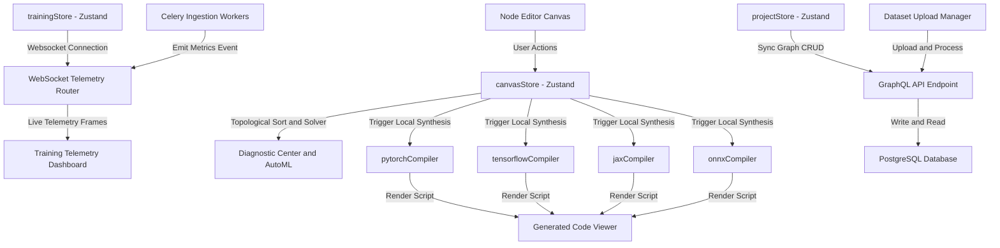
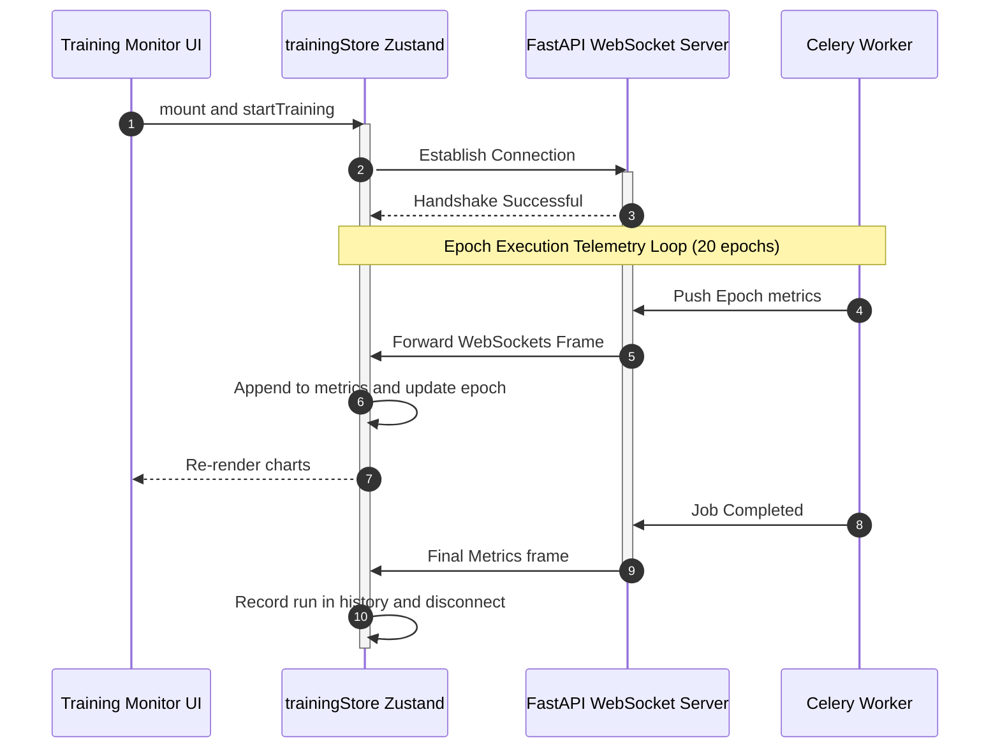

# MLBuilder Visual Neural Network Designer & Compiler

MLBuilder is an enterprise-grade, high-fidelity visual workspace for designing, auditing, compiling, and testing deep learning architectures. It empowers machine learning engineers to design complex model graphs, configure training hyperparameters, validate tensor shape matching, run animated forward passes, and instantly compile production-ready modules to PyTorch, TensorFlow, JAX, or ONNX.

---

## 🚀 Key Features

* **Interactive Canvas Workspace**: A high-performance vector graphics board powered by **Konva.js** supporting node dragging, socket connect ports, bezier linkages, multi-selection, and group operations.
* **Topological Shape Solver**: Automatically propagates and calculates tensor sizes downstream from root input parameters in real-time, verifying rank compatibility and broadcasting compliance.
* **Diagnostic Center & AutoML Copilot**: A strict AST compiler and heuristical rules auditor that scans active graphs and saved library components for loop cycles, disconnected nodes, and anti-patterns.
* **Multi-Framework Compiler**: Generates clean, production-grade Python classes (`class GeneratedModel`) conforming to standard PyTorch, TensorFlow, Flax (JAX), and ONNX specifications.
* **Dataset Manager**: Ingestion area featuring drag-and-drop CSV/ZIP uploading, tabular data previews, and database processing status tracking.
* **Training telemetry & Monitor**: stacked vertical monitor panel plotting training/validation loss and validation accuracy curves in real-time using `recharts` connected to live WebSockets.
## 🆕 Recent Updates

- Added support for a dedicated training page with updated navigation in the header.
- Introduced `onOpenTrainingConfig` prop to Header for opening training configurations.
- Conditional rendering of undo/redo, version history, and panels based on page context.
- Refactored back button behavior to navigate appropriately from training pages.
- Updated UI components to improve usability in training mode.

---

## 🏗️ Architectural Overview

### 1. General System Architecture Flow
This flowchart illustrates the relationships between the frontend workspace, state managers, compiler layers, and FastAPI/PostgreSQL cloud backends.



### 2. WebSockets Telemetry Flow
Telemetry updates from backend Celery tasks or local simulators cascade into charts and experiment histories.



---

## 🛠️ Technology Stack

| Category | Technology | Purpose |
| :--- | :--- | :--- |
| **Framework** | Next.js 16 (App Router) | Static page rendering and layout routing |
| **Core Runtime** | React 19 & TypeScript 5 | Strict typing and component hierarchy |
| **Canvas Graphics** | Konva.js & `react-konva` | Interactive workspace vector canvas |
| **State Manager** | Zustand 5 | Client-side reactive stores (Canvas, Project, Training) |
| **Charts** | Recharts v2 | Telemetry analytics charts |
| **Styling** | Tailwind CSS v4 & Vanilla CSS | Glassmorphism, animations, HSL themes |

---

## 📁 Repository Structure

```text
frontend/
├── src/
│   ├── app/                    # Next.js App Router Page View Controllers
│   │   ├── page.tsx            # Main Model Workspace landing dashboard
│   │   ├── layout.tsx          # General page template controller
│   │   ├── globals.css         # Custom background animations, scrolls and dark variables
│   │   │
│   │   ├── datasets/           # Dataset Drag-and-Drop repository page
│   │   ├── editor/[projectId]/ # Dynamic interactive Canvas Node Editor workspace
│   │   ├── models/             # Base visual templates importer panel
│   │   │   notebook/           # Jupyter-style script sandbox cell
│   │   └── settings/           # API credentials and sync setups
│   │
│   ├── components/             # Reusable Visual Custom Modules
│   │   ├── Layout/             # Universal Layout Containers (Header, Sidebar, MainLayout)
│   │   ├── Canvas/             # Interactive Canvas modules (NodeGraph, CanvasWrapper)
│   │   ├── Panels/             # Workspace panels (LayerLibrary, ConfigPanel, ValidationPanel)
│   │   ├── Modals/             # Code Preview and versioning popups
│   │   └── Training/           # Training dashboard widgets (Charts, History panels)
│   │
│   ├── store/                  # Unified State Managers
│   │   ├── projectStore.ts     # Project list fetching and auth management
│   │   ├── trainingStore.ts    # Websocket metrics and historical run records
│   │   └── canvasStore.ts      # Active canvas nodes, connections, and custom saved blocks
│   │
│   ├── lib/                    # Core compilation algorithms
│   │   └── canvas/             
│   │       ├── pytorchCompiler.ts     # Compiles canvas graph to PyTorch scripts
│   │       ├── tensorflowCompiler.ts  # Compiles canvas graph to TensorFlow code
│   │       ├── jaxCompiler.ts         # Compiles canvas graph to Flax/JAX code
│   │       └── onnxCompiler.ts        # Compiles canvas graph to ONNX binary representation
│   │
│   └── types/                  
│       └── canvas.ts           # Types for Nodes, Links, Custom Blocks, and AutoML Suggests
│
├── tsconfig.json               # TypeScript setup
├── package.json                # Project dependencies
└── next.config.ts              # Next.js bundler setup
```

---

## 💻 Installation & Quickstart

Ensure you have [Node.js](https://nodejs.org/) (v20+ recommended) installed.

### 1. Initialize Codebase & Install Dependencies
Clone the repository and install all required modules:
```bash
npm install
```

### 2. Run the Development Server
Execute the Next.js dev compiler locally:
```bash
npm run dev
```
Open [http://localhost:3000](http://localhost:3000) in your browser.

### 3. Generate Production Optimizations
Verify type check compliance and create optimized production static bundles:
```bash
npm run build
```
Start the production server:
```bash
npm run start
```

---

## 🧠 Downstream Shape Solver Rules

The topological shape solver propagates tensor dimensions downstream based on the following layer specifications:

| Layer Type (`NodeType`) | Expected Input Rank | Configuration Parameters | Spatial Output Shape Formula |
| :--- | :--- | :--- | :--- |
| **Input** | N/A | `dim` (e.g. `[224, 224, 3]`) | Returns `dim` (Base Dimensions) |
| **Conv2D** | 3D (`[H, W, C]`) | `filters`, `kernelSize`, `stride`, `padding` | **same**: `[H, W, filters]` <br> **valid**: `[outH, outW, filters]` where: <br> $outH = \lfloor\frac{H - kernelSize}{stride}\rfloor + 1$ |
| **MaxPool2D** | 3D (`[H, W, C]`) | `poolSize` | `[outH, outW, C]` where: <br> $outH = \lfloor\frac{H}{poolSize}\rfloor$ |
| **BatchNorm2D** | 3D (`[H, W, C]`) | N/A | Returns identical input shape `[H, W, C]` |
| **Dropout** | Any | `rate` | Returns identical input shape |
| **Flatten** | Any | N/A | 1D: `[size]` where $size = \prod(\text{inputShape})$ |
| **Dense** | 1D (`[Features]`) | `units` | 1D: `[units]` |

---

## 🚨 Diagnostic Center & AutoML Copilot Rules

The Diagnostic Center scans the active model canvas and saved custom blocks using the following heuristic rules:

| Issue/Category | Check Logic | Severity | Programmatic Auto-Fix Action |
| :--- | :--- | :--- | :--- |
| **Loop Cycle (`cycle`)** | Traverses graph using a DFS stack to identify cyclic paths. | **Error** | Breaks the loop by deleting the cycle-inducing edge connection. |
| **Disconnected Layer (`disconnected`)** | Runs reachability trace from the Input node to verify connection path. | **Warning** | Links the disconnected node by adding an edge from the closest upstream block. |
| **Rank Conflict (`rank`)** | Validates layer rank requirements (e.g. Dense requires 1D, MaxPool requires 3D). | **Error** | If a 3D layer links to a Dense layer, it automatically inserts a `Flatten` node in between. |
| **Broadcasting Conflict (`broadcast`)** | Verifies that incoming parent edges at merge nodes have matching dimensions. | **Error** | Alerts the designer of mismatched spatial grids or channel configurations. |
| **Activation Missing (`anti-pattern`)** | Scans all `Conv2D` layers to ensure an activation function is set. | **High Suggestion** | Configures `activation: 'ReLU'` on the target convolutional layer. |
| **Non-Standard Input (`optimization`)** | Verifies if the `Input` layer dimension matches typical 224x224 RGB grids. | **Info Suggestion** | Resizes the input shape definition to standard `[224, 224, 3]`. |
| **Parameter Explosion (`optimization`)** | Checks if Dense connections exceed 500,000 parameter weights. | **Medium Suggestion** | Reduces fully connected units to `128` to save VRAM memory footprint. |
| **Pooling Recommendation (`architecture`)** | Detects if 3 or more convolutions are stacked successively without pooling. | **Medium Suggestion** | Inserts a `MaxPool2D` layer with `poolSize: 2` after the convolutions. |

---

## 🧠 V2 Advanced Layer Extensions & Research Playground (Modules 6.1 - 6.7)

We have extended MLBuilder with advanced layer types, sequence complexity explainability, and multi-framework compiler comparative layout structures:

### 1. V2 Layer Library (Module 6.1)
* **Collapsible Accordion Categories**: Organizes standard layers, sequence-based layers, transformer block components, and graph neural network layers in a clean collapsible accordion within [LayerLibrary.tsx](file:///d:/Coding/ArchNet_frontend/src/components/Panels/LayerLibrary.tsx).
* **RNN Layer Integration**: Full integration of Recurrent Neural Networks (RNN) across store configurations, inspectors, and compiler generators.

### 2. V2 Shape Visualizations & Attention Sockets (Module 6.2 & 6.3)
* **Sequence display format**: Visualizes symbolic shapes `[B,T,D]` alongside concrete sequence lengths (e.g. `[32, 128, 768]`) for token and embedding layers.
* **Q, K, V Multi-Sockets**: Renders three vertically stacked input sockets representing Query (`Q`), Key (`K`), and Value (`V`) for `Attention` and `MultiHeadAttention` blocks on the Konva canvas, using dynamic edge routing to avoid curve overlaps.
* **Skip Connection Styling**: Automatically detects shortcut paths bypassing layers, rendering them as Coral Red (`#e57373`) dashed lines with labeled skip badges.
* **Transformer Custom Visual Nodes**: Renders head/dim details inside the MultiheadAttention block and designs a collapsed block visual for `TransformerBlock`, `EncoderBlock`, and `DecoderBlock` showing inline sequence: `Attention -> LayerNorm -> FeedFwd`.

### 3. Research Playground & Templates Marketplace (Module 6.4 & 6.5)
* **New Route `/models/research`**: A dedicated marketplace at [page.tsx](file:///d:/Coding/ArchNet_frontend/src/app/models/research/page.tsx) featuring category filters and prebuilt SOTA architectures: `BERT`, `GPT`, `Vision Transformer`, `U-Net`, and `GraphSAGE`.
* **Animated Flowchart Previews**: Renders real-time node structures, Parameter sizes, compute FLOPs, and VRAM memory aggregates for selected templates.
* **One-Click Import**: Instant insertion onto the main editor canvas via project auto-creation and routing.

### 4. Architecture Explainability Panel (Module 6.6)
* **Right Sidebar Dock**: Placed at [ExplainabilityPanel.tsx](file:///d:/Coding/ArchNet_frontend/src/components/Panels/ExplainabilityPanel.tsx) to provide real-time complexity calculations.
* **Sequence Scaling Controls**: Slider for token lengths $T \in [64, 2048]$ dynamically adjusting attention matrix size ($T^2$) and attention FLOP scales. Emits quadratic scaling warning badges for $T \ge 512$.
* **Parameter Explosion Alerts**: Checks for Conv2D layers exceeding 5M parameters and Dense layers exceeding 10M parameters directly following Flatten nodes.

### 5. Advanced Compiler Center (Module 6.7)
* **Left 30% Analytics Sidebar**: Houses parameter counts, VRAM estimation, FLOPs, and a topological Model Summary table detailing individual output shapes, layer params, and layer FLOPs.
* **Right 70% Code Viewport**: Renders PyTorch, TensorFlow, and JAX compiled scripts parallel to each other in three side-by-side columns by default.

---

## 🤝 Contribution Guidelines

1. **Keep Canvas Modules Client-Side**: All Konva stage layers rely on window coordinates. Ensure they are loaded dynamically via `CanvasWrapper.tsx` and labeled `'use client'`.
2. **Support Downstream recalculations**: When creating a new node type in `src/types/canvas.ts`, add its shape rules under `computeNodeOutputShape` inside `src/store/canvasStore.ts`.
3. **Preserve Compiler Tracing**: Ensure compiler files under `src/lib/canvas/` correctly format target codeblocks under `class GeneratedModel` to compile cleanly in Next.js and PyTorch runtime environments.
