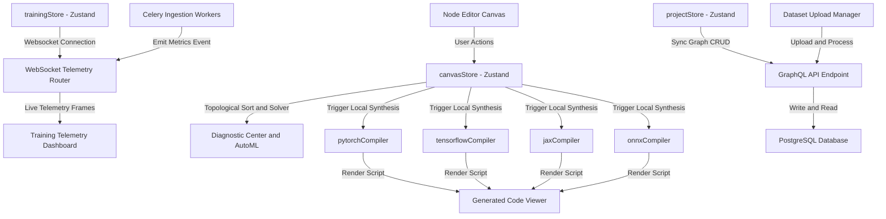
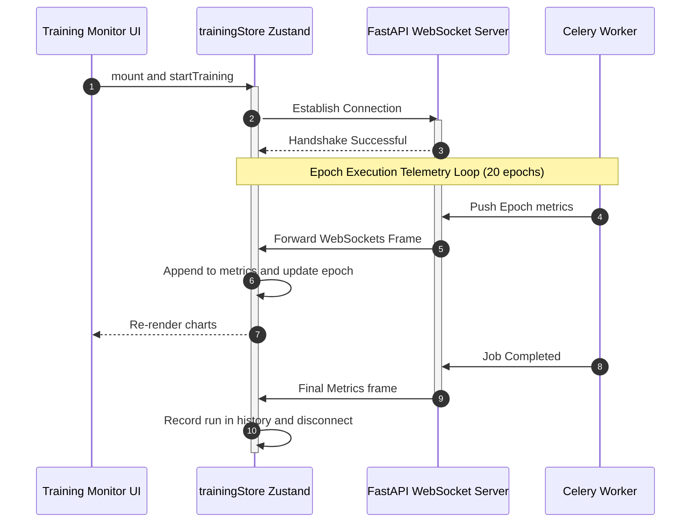

# MLBuilder Visual Neural Network Designer & Compiler

MLBuilder is an enterprise-grade, high-fidelity visual workspace for designing, auditing, compiling, and testing deep learning architectures. It empowers machine learning engineers to design complex model graphs, configure training hyperparameters, validate tensor shape matching, run animated forward passes, and instantly compile production-ready modules to PyTorch, TensorFlow, JAX, or ONNX.

---

## 🚀 Key Features

* **Interactive Canvas Workspace**: A high-performance vector graphics board powered by **Konva.js** supporting node dragging, socket connect ports, bezier linkages, multi-selection, and group operations.
* **Topological Shape Solver**: Automatically propagates and calculates tensor sizes downstream from root input parameters in real-time, verifying rank compatibility and broadcasting compliance.
* **Diagnostic Center & AutoML Copilot**: A strict AST compiler and heuristical rules auditor that scans active graphs and saved library components for loop cycles, disconnected nodes, and anti-patterns.
* **Multi-Framework Compiler**: Generates clean, production-grade Python classes (`class GeneratedModel`) conforming to standard PyTorch, TensorFlow, Flax (JAX), and ONNX specifications.
* **Dataset Manager**: Ingestion area featuring drag-and-drop CSV/ZIP uploading, tabular data previews, and database processing status tracking.
* **Training telemetry & Monitor**: stacked vertical monitor panel plotting training/validation loss and validation accuracy curves in real-time using `recharts` connected to live WebSockets.
## 🆕 Recent Updates

- Added support for a dedicated training page with updated navigation in the header.
- Introduced `onOpenTrainingConfig` prop to Header for opening training configurations.
- Conditional rendering of undo/redo, version history, and panels based on page context.
- Refactored back button behavior to navigate appropriately from training pages.
- Updated UI components to improve usability in training mode.

---

## 🏗️ Architectural Overview

### 1. General System Architecture Flow
This flowchart illustrates the relationships between the frontend workspace, state managers, compiler layers, and FastAPI/PostgreSQL cloud backends.



### 2. WebSockets Telemetry Flow
Telemetry updates from backend Celery tasks or local simulators cascade into charts and experiment histories.



---

## 🛠️ Technology Stack

| Category | Technology | Purpose |
| :--- | :--- | :--- |
| **Framework** | Next.js 16 (App Router) | Static page rendering and layout routing |
| **Core Runtime** | React 19 & TypeScript 5 | Strict typing and component hierarchy |
| **Canvas Graphics** | Konva.js & `react-konva` | Interactive workspace vector canvas |
| **State Manager** | Zustand 5 | Client-side reactive stores (Canvas, Project, Training) |
| **Charts** | Recharts v2 | Telemetry analytics charts |
| **Styling** | Tailwind CSS v4 & Vanilla CSS | Glassmorphism, animations, HSL themes |

---

## 📁 Repository Structure

```text
frontend/
├── src/
│   ├── app/                    # Next.js App Router Page View Controllers
│   │   ├── page.tsx            # Main Model Workspace landing dashboard
│   │   ├── layout.tsx          # General page template controller
│   │   ├── globals.css         # Custom background animations, scrolls and dark variables
│   │   │
│   │   ├── datasets/           # Dataset Drag-and-Drop repository page
│   │   ├── editor/[projectId]/ # Dynamic interactive Canvas Node Editor workspace
│   │   ├── models/             # Base visual templates importer panel
│   │   │   notebook/           # Jupyter-style script sandbox cell
│   │   └── settings/           # API credentials and sync setups
│   │
│   ├── components/             # Reusable Visual Custom Modules
│   │   ├── Layout/             # Universal Layout Containers (Header, Sidebar, MainLayout)
│   │   ├── Canvas/             # Interactive Canvas modules (NodeGraph, CanvasWrapper)
│   │   ├── Panels/             # Workspace panels (LayerLibrary, ConfigPanel, ValidationPanel)
│   │   ├── Modals/             # Code Preview and versioning popups
│   │   └── Training/           # Training dashboard widgets (Charts, History panels)
│   │
│   ├── store/                  # Unified State Managers
│   │   ├── projectStore.ts     # Project list fetching and auth management
│   │   ├── trainingStore.ts    # Websocket metrics and historical run records
│   │   └── canvasStore.ts      # Active canvas nodes, connections, and custom saved blocks
│   │
│   ├── lib/                    # Core compilation algorithms
│   │   └── canvas/             
│   │       ├── pytorchCompiler.ts     # Compiles canvas graph to PyTorch scripts
│   │       ├── tensorflowCompiler.ts  # Compiles canvas graph to TensorFlow code
│   │       ├── jaxCompiler.ts         # Compiles canvas graph to Flax/JAX code
│   │       └── onnxCompiler.ts        # Compiles canvas graph to ONNX binary representation
│   │
│   └── types/                  
│       └── canvas.ts           # Types for Nodes, Links, Custom Blocks, and AutoML Suggests
│
├── tsconfig.json               # TypeScript setup
├── package.json                # Project dependencies
└── next.config.ts              # Next.js bundler setup
```

---

## 💻 Installation & Quickstart

Ensure you have [Node.js](https://nodejs.org/) (v20+ recommended) installed.

### 1. Initialize Codebase & Install Dependencies
Clone the repository and install all required modules:
```bash
npm install
```

### 2. Run the Development Server
Execute the Next.js dev compiler locally:
```bash
npm run dev
```
Open [http://localhost:3000](http://localhost:3000) in your browser.

### 3. Generate Production Optimizations
Verify type check compliance and create optimized production static bundles:
```bash
npm run build
```
Start the production server:
```bash
npm run start
```

---

## 🧠 Downstream Shape Solver Rules

The topological shape solver propagates tensor dimensions downstream based on the following layer specifications:

| Layer Type (`NodeType`) | Expected Input Rank | Configuration Parameters | Spatial Output Shape Formula |
| :--- | :--- | :--- | :--- |
| **Input** | N/A | `dim` (e.g. `[224, 224, 3]`) | Returns `dim` (Base Dimensions) |
| **Conv2D** | 3D (`[H, W, C]`) | `filters`, `kernelSize`, `stride`, `padding` | **same**: `[H, W, filters]` <br> **valid**: `[outH, outW, filters]` where: <br> $outH = \lfloor\frac{H - kernelSize}{stride}\rfloor + 1$ |
| **MaxPool2D** | 3D (`[H, W, C]`) | `poolSize` | `[outH, outW, C]` where: <br> $outH = \lfloor\frac{H}{poolSize}\rfloor$ |
| **BatchNorm2D** | 3D (`[H, W, C]`) | N/A | Returns identical input shape `[H, W, C]` |
| **Dropout** | Any | `rate` | Returns identical input shape |
| **Flatten** | Any | N/A | 1D: `[size]` where $size = \prod(\text{inputShape})$ |
| **Dense** | 1D (`[Features]`) | `units` | 1D: `[units]` |

---

## 🚨 Diagnostic Center & AutoML Copilot Rules

The Diagnostic Center scans the active model canvas and saved custom blocks using the following heuristic rules:

| Issue/Category | Check Logic | Severity | Programmatic Auto-Fix Action |
| :--- | :--- | :--- | :--- |
| **Loop Cycle (`cycle`)** | Traverses graph using a DFS stack to identify cyclic paths. | **Error** | Breaks the loop by deleting the cycle-inducing edge connection. |
| **Disconnected Layer (`disconnected`)** | Runs reachability trace from the Input node to verify connection path. | **Warning** | Links the disconnected node by adding an edge from the closest upstream block. |
| **Rank Conflict (`rank`)** | Validates layer rank requirements (e.g. Dense requires 1D, MaxPool requires 3D). | **Error** | If a 3D layer links to a Dense layer, it automatically inserts a `Flatten` node in between. |
| **Broadcasting Conflict (`broadcast`)** | Verifies that incoming parent edges at merge nodes have matching dimensions. | **Error** | Alerts the designer of mismatched spatial grids or channel configurations. |
| **Activation Missing (`anti-pattern`)** | Scans all `Conv2D` layers to ensure an activation function is set. | **High Suggestion** | Configures `activation: 'ReLU'` on the target convolutional layer. |
| **Non-Standard Input (`optimization`)** | Verifies if the `Input` layer dimension matches typical 224x224 RGB grids. | **Info Suggestion** | Resizes the input shape definition to standard `[224, 224, 3]`. |
| **Parameter Explosion (`optimization`)** | Checks if Dense connections exceed 500,000 parameter weights. | **Medium Suggestion** | Reduces fully connected units to `128` to save VRAM memory footprint. |
| **Pooling Recommendation (`architecture`)** | Detects if 3 or more convolutions are stacked successively without pooling. | **Medium Suggestion** | Inserts a `MaxPool2D` layer with `poolSize: 2` after the convolutions. |

---

## 🧠 V2 Advanced Layer Extensions & Research Playground (Modules 6.1 - 6.7)

We have extended MLBuilder with advanced layer types, sequence complexity explainability, and multi-framework compiler comparative layout structures:

### 1. V2 Layer Library (Module 6.1)
* **Collapsible Accordion Categories**: Organizes standard layers, sequence-based layers, transformer block components, and graph neural network layers in a clean collapsible accordion within [LayerLibrary.tsx](file:///d:/Coding/ArchNet_frontend/src/components/Panels/LayerLibrary.tsx).
* **RNN Layer Integration**: Full integration of Recurrent Neural Networks (RNN) across store configurations, inspectors, and compiler generators.

### 2. V2 Shape Visualizations & Attention Sockets (Module 6.2 & 6.3)
* **Sequence display format**: Visualizes symbolic shapes `[B,T,D]` alongside concrete sequence lengths (e.g. `[32, 128, 768]`) for token and embedding layers.
* **Q, K, V Multi-Sockets**: Renders three vertically stacked input sockets representing Query (`Q`), Key (`K`), and Value (`V`) for `Attention` and `MultiHeadAttention` blocks on the Konva canvas, using dynamic edge routing to avoid curve overlaps.
* **Skip Connection Styling**: Automatically detects shortcut paths bypassing layers, rendering them as Coral Red (`#e57373`) dashed lines with labeled skip badges.
* **Transformer Custom Visual Nodes**: Renders head/dim details inside the MultiheadAttention block and designs a collapsed block visual for `TransformerBlock`, `EncoderBlock`, and `DecoderBlock` showing inline sequence: `Attention -> LayerNorm -> FeedFwd`.

### 3. Research Playground & Templates Marketplace (Module 6.4 & 6.5)
* **New Route `/models/research`**: A dedicated marketplace at [page.tsx](file:///d:/Coding/ArchNet_frontend/src/app/models/research/page.tsx) featuring category filters and prebuilt SOTA architectures: `BERT`, `GPT`, `Vision Transformer`, `U-Net`, and `GraphSAGE`.
* **Animated Flowchart Previews**: Renders real-time node structures, Parameter sizes, compute FLOPs, and VRAM memory aggregates for selected templates.
* **One-Click Import**: Instant insertion onto the main editor canvas via project auto-creation and routing.

### 4. Architecture Explainability Panel (Module 6.6)
* **Right Sidebar Dock**: Placed at [ExplainabilityPanel.tsx](file:///d:/Coding/ArchNet_frontend/src/components/Panels/ExplainabilityPanel.tsx) to provide real-time complexity calculations.
* **Sequence Scaling Controls**: Slider for token lengths $T \in [64, 2048]$ dynamically adjusting attention matrix size ($T^2$) and attention FLOP scales. Emits quadratic scaling warning badges for $T \ge 512$.
* **Parameter Explosion Alerts**: Checks for Conv2D layers exceeding 5M parameters and Dense layers exceeding 10M parameters directly following Flatten nodes.

### 5. Advanced Compiler Center (Module 6.7)
* **Left 30% Analytics Sidebar**: Houses parameter counts, VRAM estimation, FLOPs, and a topological Model Summary table detailing individual output shapes, layer params, and layer FLOPs.
* **Right 70% Code Viewport**: Renders PyTorch, TensorFlow, and JAX compiled scripts parallel to each other in three side-by-side columns by default.

---

## 🤝 Contribution Guidelines

1. **Keep Canvas Modules Client-Side**: All Konva stage layers rely on window coordinates. Ensure they are loaded dynamically via `CanvasWrapper.tsx` and labeled `'use client'`.
2. **Support Downstream recalculations**: When creating a new node type in `src/types/canvas.ts`, add its shape rules under `computeNodeOutputShape` inside `src/store/canvasStore.ts`.
3. **Preserve Compiler Tracing**: Ensure compiler files under `src/lib/canvas/` correctly format target codeblocks under `class GeneratedModel` to compile cleanly in Next.js and PyTorch runtime environments.

<!-- 


ArchNet Canvas Workspace — Detailed Walkthrough
A comprehensive, section-by-section guide to every feature of the Canvas Editor.

Table of Contents
Overview & Layout
Header Toolbar
Layer Library (Left Panel)
The Canvas — Node Graph
Inspector / Config Panel (Right Panel)
Side Panels (Toggle Windows)
Workspace Minimap
Collaboration System
Model Versioning & Auto-Save
Keyboard Reference
1. Overview & Layout
The Canvas Editor (/editor/:projectId) is the core workspace where ML models are visually designed. When a canvas first opens, only the IDE Terminal Console panel is visible by default — a clean slate for the builder.

The workspace is divided into four primary zones:


┌──────────────────────────────────── HEADER (56px) ────────────────────────────────────────┐
│  [← Back] [Project Name] [Framework] [Status] [Sync] │ [Undo/Redo][History][Workspace].. │
├──────────┬────────────────────────────────────────────┬──────────────┬─────────────────────┤
│  LAYER   │                                            │  INSPECTOR   │  SIDE PANEL         │
│ LIBRARY  │            CANVAS (NodeGraph)             │  (Config)    │  (AI Copilot /      │
│ (Left)   │                                            │              │   Validation /      │
│          │  🔲 Nodes + Bezier Edges + Animations     │              │   Explainability)   │
│          │                                            │              │                     │
│          │                         [Minimap]          │              │                     │
└──────────┴────────────────────────────────────────────┴──────────────┴─────────────────────┘
Key Files:

NodeGraph.tsx
 — canvas engine
LayerLibrary.tsx
 — left sidebar
ConfigPanel.tsx
 — right inspector
Header.tsx
 — toolbar
canvasStore.ts
 — all state & actions
2. Header Toolbar
The header uses a 3-zone grid layout (grid-cols-[auto_1fr_auto]).

Zone 1 — Left: Project Identity
Element	Action
← Back button	Returns to dashboard (or back to canvas from sub-pages like Training, Deploy)
Project Name pill	Displays current project name. Double-click to rename inline. Press Enter to save, Escape to cancel.
Framework badge	Shows the compiled framework (🔥 PyTorch / 🍊 TensorFlow / ⚡ JAX / 💎 ONNX)
Status badge	Color-coded: Production Ready (green), Training (amber/pulsing), Draft (cyan)
Sync badge	Synced (green), Syncing (amber), Local (red) — reflects WebSocket collaboration status
Draft badge	Spinning icon while saving, checkmark when saved, triangle on error
Zone 2 — Center: Workspace Toolstrip
Only visible on the Canvas route (not Training / Deploy sub-pages)

Control	Description
Undo / Redo pills	Step backward/forward through graph operations. Disabled for Viewers.
Clock (Version History)	Dropdown listing named model checkpoints. Each entry shows a timestamp, allows Restore or Delete.
Workspace button	Split toggle: the main label acts as an "all panels on/off" toggle. A ▾ chevron opens a dropdown with per-panel toggles (Layer Library, Inspector, AI Copilot, Validation, Explainability, Console) plus layout presets.
Run / Forward Pass	Animated play button. Triggers a simulated forward pass — draws packet animations along edges, shows tensor flow in real time.
Blocks Guide	Opens the 
BlockGuideModal.tsx
 — a reference for all available layer types.
Compiler / Code button	Fires onGenerateCode → opens the 
CodePreviewModal.tsx
 with generated PyTorch/TensorFlow code.
Export button	Opens 
ExportModal.tsx
 for ONNX/Triton export.
Compare button	Opens 
DiffViewerModal.tsx
 for version diff comparison.
Zone 3 — Right: Actions & User
Control	Description
User Avatar	Click to open profile dropdown. Shows username, active role badge, and Log Out option.
Role selector	Hidden inside profile menu. Switch between Editor, Reviewer, and Viewer roles — changes affect what can be edited on the canvas.
3. Layer Library (Left Panel)
File: 
LayerLibrary.tsx

The Library is a 320px-wide collapsible sidebar. Use the ‹ chevron on its right edge to collapse it into an icon stub. Click the › stub to re-expand.

Layer Groups
Layers are organized into 4 collapsible categories (click the category header to expand/collapse):

Category	Layers
Standard Layers	Input, Conv2D, BatchNorm2D, MaxPool2D, Dropout, Flatten, Dense, ResidualAdd
Sequence Layers	Embedding, RNN, LSTM, GRU, BiLSTM
Transformer Layers	PositionalEncoding, Attention, MultiHeadAttention, LayerNorm, TransformerBlock, EncoderBlock, DecoderBlock
Graph Layers	GCN, GraphSAGE, GAT
How to add a layer: Click any layer card — it spawns on the canvas at a random offset around (200, 150). Each card shows:

A color dot matching the node's canvas color
The layer type name (e.g. Conv2D)
A short description (e.g. Spatial convolution layer)
🔒 Viewer Mode: The Library shows a frosted glass lock overlay. All click actions are disabled.

Custom Blocks
Below the standard layers, there is a Custom Blocks section. Custom blocks are multi-layer sub-graphs that have been saved as a reusable unit:

Empty state prompts you to select layers and use "Save Block" from the bottom dock
Each saved block shows its name, node count, and edge count
Click to spawn the block at the center of the current viewport
Trash icon (hover to reveal) — permanently deletes the custom block
Prebuilt Architectures
The bottom section lists 13 complete architecture templates:

Name	Type
Sentiment Classifier, Text Classifier, Seq2Seq	NLP
Mini-BERT, Mini-GPT, Transformer Encoder, ViT	Transformer
ResNet18, ResNet50, MobileNet	Classification
U-Net	Segmentation
GCN, GraphSAGE	Graph
Click any template card → a confirmation dialog asks before replacing the current canvas graph.

4. The Canvas — Node Graph
File: 
NodeGraph.tsx

The canvas is a hardware-accelerated Konva Stage rendered inside a ResizeObserver-aware container. It throttles resize events to ~30 FPS to maintain fluid panel drag-resizing.

4.1 Navigation
Action	How
Pan	Click and drag on empty canvas space
Zoom	Scroll wheel — zooms centered on the mouse cursor (0.25× → 2.0× range, ×1.15 per step)
Jump to node	Search using the Graph Search feature (or clicking a node in the minimap)
4.2 Node Colors (by type)
Each node type has a distinct Material Dark color:

Color	Types
🟢 Emerald Green #81c784	Input
🔵 Material Blue #8ab4f8	Conv2D
🌸 Rose Pink #f48fb1	BatchNorm2D, LayerNorm
🩵 Dark Teal #80cbc4	MaxPool2D
🟠 Soft Orange #ffab91	Dropout
🟣 Soft Purple #c5a3ff	Flatten
🟡 Amber Yellow #ffe082	Dense
🩵 Deep Cyan #26c6da	Embedding
🟠 Gold #ffb74d	PositionalEncoding
💜 Lavender #b39ddb	Attention, MultiHeadAttention
🔴 Coral Red #e57373	ResidualAdd
💙 Indigo Blue #9fa8da	TransformerBlock, EncoderBlock, DecoderBlock
🩵 Pale Cyan #80deea	RNN, LSTM, GRU, BiLSTM
🟢 Pale Green #a5d6a7	GCN, GraphSAGE, GAT
4.3 Node Anatomy
Each node is a 220×80px rounded rectangle containing:

Color dot — top-left, identifies layer type
Node name — editable via the Inspector panel
Layer-specific subtitle — inline key parameters (e.g. FILTERS 64, KERNEL 3x3, UNITS 10)
Left input socket(s) — circle port on the left edge. Attention/MultiHeadAttention nodes show 3 labeled sockets: Q, K, V
Right output socket — circle port on the right edge
Error/warning badge — red or amber circle in the top-right corner showing the count of validation errors
Hover tooltip — shows the first validation error message when the node has errors
Special Node Rendering
TransformerBlock / EncoderBlock / DecoderBlock — rendered with a mini sub-graph inside: Attention → LayerNorm → FeedFwd as inline blocks
Heatmap overlay — when heatmap mode is active, a translucent colored fill and glowing border appear, proportional to the metric value
Stats overlay — when Stats Overlay is enabled, a card below each node shows P: (Params), F: (FLOPs), L: (Latency), V: (VRAM)
4.4 Selection
Action	Result
Click a node	Single-selects it (blue border, 2.2px stroke)
Shift + Click	Adds/removes the node from the current selection
Shift + Drag on empty space	Draws a marquee selection box — all nodes whose center falls inside are selected
Click on empty space	Clears selection
4.5 Moving Nodes
Drag any selected node to move it
If multiple nodes are selected, all move together by the same offset (batch move)
Movement snaps to a 20px grid by default
Hold Alt while dragging to bypass grid snapping for free placement
4.6 Connecting Nodes (Edges)
Click the right output socket of any node → the cursor enters "connect mode" (socket highlights blue, a preview dashed line appears)
Click the left input socket of a target node → the connection is created as a Bezier curve
Click on an existing edge → a browser confirm() dialog asks to delete the connection
Edge Visual Properties
Edge type	Appearance
Normal	Solid blue #8ab4f8, 60% opacity
Skip/Residual	Dashed coral red #e57373, labeled Skip Connection
Animated (forward pass)	Purple #c5a3ff, wider stroke, with two animated "tensor packets" (glowing circles) traveling along the Bezier path
Broadcast error	Dashed red #f28b82, 95% opacity
Each edge also shows a throughput label at its midpoint:

Standard layers: shows output tensor shape + byte size (e.g. 112x112x64 (3.1 MB))
Sequence layers: shows [B,T,D]: [32,512,128]
Attention nodes (single input): shows 3 label positions for Q/K/V routes
4.7 Node Groups
Multiple selected nodes can be grouped into a collapsible folder container:

Click the Group button in the bottom dock when 2+ nodes are selected
The group renders as a dashed border bounding box with a colored label at the top
Buttons inside the group header: COLLAPSE (packs all group nodes into a single folder icon) and UNPACK (dissolves the group)
Collapsed groups render as a single 220×80 node with a folder icon, showing the group name and layer count. Double-click to expand.
Collapsed groups can be dragged like regular nodes; all internal nodes move together
4.8 Alignment Tools
When multiple nodes are selected, alignment actions are available from the bottom dock:

Action	Effect
Align Top	Sets all selected nodes to the Y position of the topmost node
Align Left	Sets all selected nodes to the X position of the leftmost node
Distribute Horizontally	Evenly spaces selected nodes along the X axis
Distribute Vertically	Evenly spaces selected nodes along the Y axis
4.9 Auto-Layout
The Auto-Layout action (accessible from the Workspace dropdown or AI Copilot) uses the Dagre graph layout algorithm to automatically reorder all nodes into a clean left-to-right hierarchy based on edge connections.

4.10 Heatmap Mode
The header toolbar exposes a Heatmap selector with 4 modes:

Mode	Heatmap Color	Shows
none	—	Standard node display
flops	Red #ff4d4d	Relative FLOP count per node
memory	Purple #c5a3ff	Relative VRAM usage per node
latency	Amber #ffe082	Relative estimated latency per node
The intensity of the glow and fill scales proportionally against the max metric across all nodes.

4.11 Stats Overlay
Toggle via Stats Overlay button in the header. Adds a card beneath every node displaying:

P: — Parameter count (e.g. 2.3M Params)
F: — FLOPs (e.g. 115.6M FLOPs)
L: — Estimated latency (e.g. 9.63ms)
V: — Weight memory (e.g. 9.2 MB)
4.12 Graph Search
The Graph Search modal lets you jump to any node by name. The found node gets a pulsing amber highlight ring (#ffe082) that uses Math.sin(animTime * 30) to animate opacity — it disappears when another node is selected.

5. Inspector / Config Panel (Right Panel)
File: 
ConfigPanel.tsx

A 320px-wide panel that appears when a node is selected. When no node is selected, the panel renders null (empty space).

🔒 Viewer Mode: A frosted glass overlay blocks all inputs. The panel shows "Inspector Restricted."

Sections
5.1 Identity
Layer Name text input — renames the node in real-time (synced across all collaborators)
5.2 Hyperparameters (by layer type)
Each layer type exposes its own parameter controls:

Layer	Controls
Input	H / W / C number inputs (sets spatial dimensions + channels)
Conv2D	Filters (slider 8–2048), Kernel Size (1–11 odd), Stride (1–4), Padding (same/valid buttons), Activation (ReLU/Sigmoid/Tanh/Softmax/None)
MaxPool2D	Pool Size (2–8), Stride (1–8)
Dense	Projection Units (2–512)
BatchNorm2D / LayerNorm / Attention / ResidualAdd	Info card (fixed parameters, no sliders)
Dropout	Rate (0.0–0.9 slider)
Embedding	Vocab Size (number input), Embedding Dim (16–2048 slider)
PositionalEncoding	Max Sequence Length (number input), Embed Dim (16–2048 slider)
MultiHeadAttention	Number of Heads (1–32), Embed Dim (16–2048)
TransformerBlock / EncoderBlock / DecoderBlock	Num Heads (1–32), Embed Dim (16–2048), Hidden (FFN) Size (64–8192)
RNN / LSTM / GRU / BiLSTM	Hidden Size (8–2048), Return Sequences (Yes 3D / No 2D)
GCN / GraphSAGE / GAT	Out Features (4–2048)
5.3 Tensor Flow State
Shows computed tensor shapes at the selected node:

Input Tensor: shape coming in (e.g. [224, 224, 3])
Output Tensor: propagated shape after the operation (or Calculating...)
5.4 Delete Block
A red-tinted "Delete Visual Block" button at the bottom permanently removes the node and all its connections from the graph.

6. Side Panels (Toggle Windows)
Controlled by the Workspace button in the header. Each panel can be individually toggled.

6.1 AI Copilot Panel
File: 
AICopilotPanel.tsx

A chat-style interface for interacting with the MLBuilder Copilot assistant.

Context Ribbon (top): Shows the active project name, active dataset, and selected node count — giving the AI context awareness.

Architecture Intent Engine — maps free-text prompts to actions:

Prompt Pattern	Action
"Build a ResNet50 / ViT / BERT / GPT / MobileNet / U-Net..."	Loads the matching prebuilt architecture template
"Build DenseNet / AlexNet / LeNet"	Generates a custom graph from Layer Library blocks
"Add a Conv2D / Dense / Dropout..."	Inserts a single node at (600, 300)
"Fix / align / compile / resolve..."	Runs auto-layout + compilation validation
"Deploy / export / ONNX..."	Navigates to the Model Registry
"Cost / GPU / optimize / VRAM..."	Sets cluster priority to Low, GPU throttle to 50%
Each AI response includes an action card with a labeled button to execute the suggested action.

Quick Suggestions (bottom bar): One-click prompts — Build ViT, Apply Fix, Optimize Cost, Deploy Model.

Chat history persists across sessions via localStorage.

6.2 Validation Panel
File: 
ValidationPanel.tsx

Shows compilation/validation results including:

Tensor shape mismatches
Broadcast errors between connected layers
Missing connections
Architecture warnings
Errors are color-coded: red for errors, amber for warnings.

6.3 Explainability Panel
File: 
ExplainabilityPanel.tsx

Provides interpretability tools and architecture explanations for the currently designed model.

6.4 Console / Terminal
The IDE Terminal Console is the only panel visible by default when a canvas first opens. It shows:

Info logs from operations (e.g. "Selecting output port from node...")
Compilation results
Training progress / telemetry
System messages
7. Workspace Minimap
Location: Top-right corner of the canvas, always visible (z-index 30).

A 176×128px SVG overlay that provides:

Colored node rectangles — scaled-down representation of all nodes using their type color
Blue viewport frame — shows the current visible area of the stage relative to the whole graph
Collaborator cursors — small colored dots showing where other active users are
Click/drag to navigate — click anywhere in the minimap to instantly jump the viewport to that region; drag to pan continuously
The minimap automatically re-calculates bounds as nodes are added/moved, adding 200px padding on all sides.

8. Collaboration System
ArchNet includes a real-time multi-user collaboration system built on WebSockets.

Sync States
State	Badge	What it means
connected	🟢 Synced	WebSocket is open, graph changes sync to all collaborators
connecting	🟡 Syncing	WS is reconnecting or handshaking
disconnected	🔴 Local	No connection — working in local sandbox mode
Live Features (when connected)
Cursor broadcasting — every user's cursor position is shown on the canvas as a colored arrow + name tag (throttled to 80ms intervals to reduce CPU/socket overhead)
Selection broadcasting — when you select a node, other users see a dashed colored border around that node with [username] selecting floating above it
Node changes — adding, moving, and connecting nodes is broadcast to all users in the same project room in real-time
9. Model Versioning & Auto-Save
Auto-Save (Draft)
The canvas triggers an auto-save 1.5 seconds after any change. The Draft badge in the header reflects the save state:

Spinning ↻ = saving
Checkmark ✓ = saved
Triangle ⚠ = save error
Named Checkpoints
Open the Version History dropdown (clock icon in the header) to:

See all saved checkpoints with timestamps
Save a new checkpoint by typing a name and clicking Save
Restore a checkpoint — replaces the current canvas with the saved graph
Delete a checkpoint
Checkpoints are stored in canvasStore.checkpoints and persist via the backend.

10. Keyboard Reference
Shortcut	Action
Ctrl+Z	Undo last operation
Ctrl+Y	Redo
Scroll	Zoom in/out (centered on cursor)
Drag (empty space)	Pan the canvas
Shift + Drag	Marquee-select multiple nodes
Shift + Click (node)	Add/remove node from selection
Alt + Drag (node)	Move without grid snapping
Click (edge)	Prompt to delete connection
Double-click (group)	Expand/collapse group
Esc (rename input)	Cancel project rename
Enter (rename input)	Save project rename
Architecture Deep-Dive: How Tensor Shape Propagation Works
When a node's config changes, recalculateShapes() in canvasStore.ts runs a topological sort of all nodes (Kahn's algorithm), then propagates shapes forward through the graph:

Input → sets outputShape = [H, W, C] from config
Conv2D → computes output spatial dims using stride and padding formulas
MaxPool2D → divides spatial dims by pool size / stride
Flatten → collapses spatial dims into a single vector
Dense → outputs [units]
Embedding → outputs [seq_len, embed_dim]
Sequence (LSTM/GRU etc.) → propagates [seq_len, hidden_size] or [hidden_size] depending on return_sequences
Attention → expects Q/K/V inputs, outputs same sequence shape
This enables the Inspector's Tensor Flow State section to always show up-to-date input/output tensor dimensions, and the Validation Panel to detect shape mismatches in real time. -->